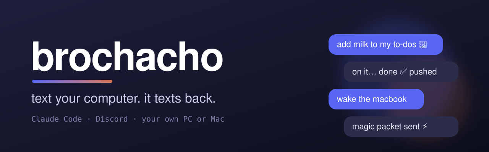
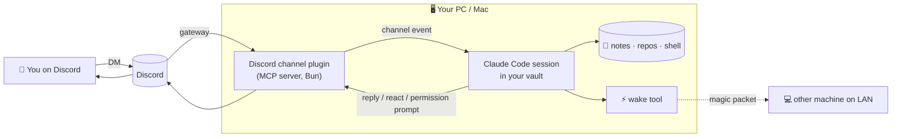

<p align="center">
  
</p>

<p align="center">
  
  
  
  
  
</p>

**Brochacho** turns a Discord DM into a remote control for [Claude Code](https://code.claude.com) running on **your own computer**.
Text it from your phone ("add milk to my to-dos", "summarize what I worked on this week", "fix the failing test in my app")
and Claude does the work on your real files, then texts you back. No cloud VM, no copying files around: it's your PC or Mac, your notes, your repos.

I built it to talk to my Obsidian "second brain" vault on the go, but it works with any folder.

---

## ✨ What it does

| | |
|---|---|
| 💬 **Chat from anywhere** | DM the bot on Discord; replies, reactions and file attachments come back in the same chat. |
| 🖥️ **Runs on your machine** | A normal Claude Code session in your vault/project folder, with your tools, git and files. |
| 🔐 **Approve from your phone** | When Claude wants to run a command, an **Allow / Deny** prompt lands in your DM. File edits are auto-approved. |
| 🔒 **Only you** | Sender allowlist: anyone else who DMs the bot is silently ignored. |
| ⚡ **Wake-on-LAN** | "wake the pc": Brochacho on one machine sends a magic packet to wake another on your network. |
| 🖱️ **One click on** | Desktop shortcut (Windows) / `Brochacho.command` (macOS), optional auto-start at login, auto-restart if it crashes. |
| 🔁 **Syncs your machines** | Pulls the vault on start and commits + pushes changes, so your other computer gets them. |

## 🧠 How it works



Brochacho is built on Claude Code [**channels**](https://code.claude.com/docs/en/channels): an MCP server that *pushes* events into a session
that's already running. The official `discord@claude-plugins-official` plugin bridges a Discord bot to that session.
This repo adds the parts that make it a daily driver:

- **Launchers** (`windows/start-brochacho.ps1`, `macos/start-brochacho.sh`): single-instance lock, `git pull` on start, auto-restart loop, optional keep-awake, and a persona prompt ([`brochacho.md`](brochacho.md)).
- **Installers**: Bun + plugin install, Desktop shortcut with an icon, auto-start, and registering the machine for Wake-on-LAN.
- **Token setup**: paste the bot token once; the script saves it outside your repo, derives the bot's ID from the token and opens the invite link with exactly the permissions needed.
- **Wake tools** (`tools/wake.ps1`, `tools/wake.py`): dependency-free Wake-on-LAN, driven by `~/.brochacho/machines.json`.

## 🚀 Setup

**You need:** [Claude Code](https://code.claude.com/docs/en/quickstart) logged in with a claude.ai (Pro/Max) account or Console API key, git, and a Discord account.

### 1. Create the bot (Discord Developer Portal, ~2 min)
1. [discord.com/developers/applications](https://discord.com/developers/applications) → **New Application** → name it.
2. **Bot** → turn on **Message Content Intent** → **Save** → **Reset Token** → copy it.
3. Create (or pick) a Discord server for the bot; Discord only lets you DM bots you share a server with.

### 2. Install

<details open>
<summary><b>Windows</b></summary>

```powershell
git clone https://github.com/Afaguayo/brochacho.git; cd brochacho
.\windows\install.ps1 -Vault "$HOME\Documents\SecondBrain" -Autostart   # shortcut + start at login
.\windows\setup.ps1                                                       # paste the token
```
</details>

<details>
<summary><b>macOS</b></summary>

```bash
git clone https://github.com/Afaguayo/brochacho.git && cd brochacho
./macos/install.sh            # Bun, plugin, ~/Desktop/Brochacho.command
./macos/setup.sh              # paste the token
BROCHACHO_VAULT=~/Documents/SecondBrain ./macos/start-brochacho.sh
```
</details>

### 3. Pair
DM your bot **hi** → it answers with a code → in the Brochacho window:
```
/discord:access pair <code>
/discord:access policy allowlist
```
That's it. Text it anything.

## ⚡ Waking a sleeping computer

A sleeping computer can't read Discord, so something awake on the same network has to wake it:

- **From the other machine:** if your Mac is running Brochacho, DM "wake the pc" and it runs `wake.py pc`. Works both ways.
- **From your phone at home:** any Wake-on-LAN app, using the MAC address from `~/.brochacho/machines.json`.
- **From your phone away from home:** magic packets don't cross the internet. Use [Tailscale](https://tailscale.com) with an always-on device at home, or your router's built-in WoL.

Brochacho reconnects to Discord on its own after the machine wakes. Requirements: on Windows, **Wake on Magic Packet** enabled on the network adapter (the installer checks it) and a wired connection is most reliable. Waking from full shutdown also needs *Fast Startup* off and WoL on in the BIOS. On macOS, turn on **Wake for network access** (laptops only honor it while plugged in).

To never sleep while it runs instead: `start-brochacho.ps1 -StayAwake` / `start-brochacho.sh --stay-awake`.

## 🔐 Security notes

- The bot token lives in `~/.claude/channels/discord/.env` (never in this repo; `.gitignore` covers `.env`). Treat it like a password: if it leaks, **Reset Token** in the portal.
- Lock the bot to `allowlist` after pairing. Anyone on the allowlist can make Claude run commands on your machine.
- Brochacho runs with `--permission-mode acceptEdits`: file edits in the folder are auto-approved, shell commands ask you in Discord. It deliberately does **not** use `--dangerously-skip-permissions`.
- Turn on 2FA for your Discord account: your account is the key to your computer now.

## ⚠️ Limits

- Channels are a Claude Code **research preview**; the `--channels` flag may change.
- Messages only arrive while the Brochacho window is open on an awake machine.
- Run one machine per bot token at a time (the launcher prevents duplicates on the same machine, not across machines). For two always-on machines, make two bots.

## 📁 Layout

```
brochacho.md            persona prompt appended to every session
windows/                install.ps1 · setup.ps1 · start-brochacho.ps1
macos/                  install.sh  · setup.sh  · start-brochacho.sh
tools/                  wake.ps1 · wake.py (Wake-on-LAN)
machines.example.json   format of ~/.brochacho/machines.json
docs/                   banner, icon
```

---

<p align="center">Built by <a href="https://github.com/Afaguayo">@Afaguayo</a> with Claude Code · MIT License</p>
