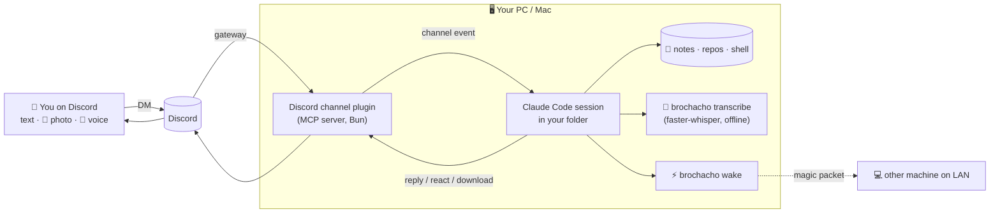

<p align="center">
  
</p>

<p align="center">
  
  
  
  
  
</p>

**Brochacho** turns a Discord DM into a remote control for [Claude Code](https://code.claude.com) running on **your own computer**.
Text it from your phone, send it a photo, or just hold the mic button and talk: "add milk to my to-dos", "what's this error?" 📸,
"summarize what I worked on this week" 🎤. Claude does the work on your real files and texts you back.
No cloud VM, no copying files around: it's your PC or Mac, your notes, your repos.

---

## ✨ What it does

| | |
|---|---|
| 💬 **Chat from anywhere** | DM the bot on Discord; replies, reactions and files come back in the same chat. |
| 🎤 **Voice messages** | Send a Discord voice note. It's transcribed **on your computer** (free, private, no API key) and handled like a typed message. |
| 📸 **Photos and files** | Send a screenshot, receipt, whiteboard or PDF. Claude opens it automatically and uses it. |
| 🤖 **Hands-free** | Claude finishes the job without asking you to approve every step. Only risky actions ask, with an Allow / Deny button in Discord. |
| 🖥️ **Runs on your machine** | A normal Claude Code session in your folder, with your tools, git and files. |
| 🔒 **Only you** | Locked to your Discord account; anyone else who DMs the bot is ignored. |
| ⚡ **Wake-on-LAN** | "wake the pc": Brochacho on one machine wakes another on your network. |
| 🖱️ **One click** | One program for setup and launch. Desktop shortcut, optional start at login, restarts itself if it crashes. |

## 📥 Download

| Your computer | Download |
|---|---|
| **Windows 10 / 11** | [**Brochacho.exe**](https://github.com/Afaguayo/brochacho/releases/latest/download/Brochacho.exe) |
| **Mac with Apple silicon** (M1 and newer) | [brochacho-macos-arm64](https://github.com/Afaguayo/brochacho/releases/latest/download/brochacho-macos-arm64) |
| **Mac with Intel** | [brochacho-macos-x64](https://github.com/Afaguayo/brochacho/releases/latest/download/brochacho-macos-x64) |

Not sure which Mac you have? Apple menu > **About This Mac**: "Chip: Apple M…" means Apple silicon.

Prefer a one-line install? It downloads the right file and starts setup:

```powershell
# Windows (PowerShell)
irm https://raw.githubusercontent.com/Afaguayo/brochacho/main/install.ps1 | iex
```
```bash
# macOS (Terminal)
curl -fsSL https://raw.githubusercontent.com/Afaguayo/brochacho/main/install.sh | bash
```

## ✅ What you need before you start

| Requirement | Why | Cost |
|---|---|---|
| A **Claude** account with **Pro or Max**, or a Console API key | Claude is the brain | paid plan |
| A **Discord** account (phone app recommended) | You talk to Brochacho there | free |
| A Windows 10/11 PC or a Mac | Brochacho runs on it | |
| About **15 minutes** and an internet connection | Setup | |

That's it. The setup wizard checks for and installs everything else for you: **git**, **Claude Code**, **Bun** (runs the Discord plugin) and **uv** (runs the speech-to-text for voice messages).

## 🚀 Setup, step by step

### 0. Open the program

<details open>
<summary><b>Windows</b></summary>

1. Double-click **Brochacho.exe**.
2. Windows may show **"Windows protected your PC"**. That's because the program isn't signed with a paid certificate. Click **More info**, then **Run anyway**.
3. A black window opens with the setup wizard. Everything happens in that window; answer the questions and press Enter.

Setup copies the program to `%LOCALAPPDATA%\Programs\Brochacho`, so you can delete the download afterwards.
</details>

<details open>
<summary><b>macOS</b></summary>

If you used the one-line installer, skip to step 1: the wizard is already running.

1. Open **Terminal** (Spotlight: type Terminal).
2. Make the download runnable and start it (adjust the name if you have the Intel version):
   ```bash
   cd ~/Downloads
   xattr -d com.apple.quarantine brochacho-macos-arm64 2>/dev/null
   chmod +x brochacho-macos-arm64 && ./brochacho-macos-arm64
   ```
   The first line tells macOS you trust the download. Without it, macOS says the app "can't be opened because the developer cannot be verified".

Setup copies the program to `~/.brochacho/bin/brochacho`, so you can delete the download afterwards.
</details>

### What the wizard walks you through

| Step | What happens | What you do |
|---|---|---|
| **1. Install what's needed** | Checks git, Claude Code, Bun and uv. | Press **Enter** to install anything missing. On a Mac, git may open an Apple window: click **Install**. |
| **2. Sign in to Claude** | Opens your browser if Claude Code isn't signed in yet. | Approve the sign-in in the browser. |
| **3. Pick a folder** | Claude works inside this folder (your notes vault, a project…). | Press Enter for the suggestion or type a path. |
| **4. Create your Discord bot** | Opens the [Discord Developer Portal](https://discord.com/developers/applications) and lists each click. | **New Application** > name it > **Bot** > turn on **Message Content Intent** > **Save** > **Reset Token** > **Copy**, then paste the token into the wizard. The wizard checks the token with Discord and warns you if the intent is still off. Then it opens the invite page: pick a server and **Authorize**. |
| **5. Discord plugin** | Installs the official Claude Code Discord plugin. | Nothing. |
| **6. How independent** | Lets you pick how often Brochacho asks before acting (see below). | Press Enter for **Hands-free**. |
| **7. Voice messages** | Downloads the offline speech engine once (~200 MB). | Press Enter to turn voice on. |
| **8. Shortcuts** | Creates a **Brochacho** shortcut on your Desktop (and in the Start menu on Windows), optional start at login and keep-awake. | Answer y / n. |
| **9. Pair your account** | Opens the Brochacho window and waits. | DM your bot **hi** on Discord. Type the 6-character code it sends you into the wizard. The bot is now locked to you. |

> The first time the Brochacho window opens, Claude Code may ask you to **trust the folder** or confirm the permission mode. Answer once in that window; it remembers.

You can stop at any step and run the program again: it picks up where you left off and keeps your earlier answers.

## 📱 Using it

1. Turn it on: double-click **Brochacho** on your Desktop. Keep the window open; closing it turns Brochacho off.
2. Text your bot. Some ideas:
   - "what's on my to-do list?" · "add 'call mom' for Friday"
   - 📸 a photo of a receipt: "log this in my expenses"
   - 📸 a screenshot of an error: "why is this happening in my app?"
   - 🎤 a voice note while walking: "remind me to email the professor about the lab report"
   - "summarize what changed in my notes this week" · "wake the pc"
3. Long jobs: it texts "on it" right away and pings you when it's done.

### 🎤 Voice messages
In Discord, hold the **mic** button in your DM with the bot and talk. Brochacho downloads the voice note, transcribes it on your computer with [faster-whisper](https://github.com/SYSTRAN/faster-whisper) and replies starting with **"🎤 heard: …"** so you can catch mishearings. Nothing leaves your machine except the normal Claude request. Any language Whisper knows works.

### 📸 Photos and files
Attach images (screenshots, receipts, handwritten notes), PDFs, text or code files. Claude opens them on its own; you don't need to say "look at the picture". If something should be kept, it saves a copy in your folder.

## 🤖 How independent is it?

Chosen in setup step 6. Change it any time: open Brochacho > **Re-run setup**.

| Mode | What it does | Good for |
|---|---|---|
| **Hands-free** (default) | Claude Code's *auto mode*: Claude just works. A safety check blocks risky actions (mass deletes, leaking secrets, force-pushes) and asks you in Discord. | Daily use from your phone |
| **Ask before commands** | File edits and everyday commands (git, ls, grep…) run on their own; any other command sends you an **Allow / Deny** button. | Being careful |
| **Full trust** | Never asks (`--dangerously-skip-permissions`). | Only with Discord 2FA on and the bot locked to you |

In every mode, Discord replies, reading photos and voice notes, and Brochacho's own tools are pre-approved, and Claude is told to finish tasks instead of asking "should I…?". Reading your bot token or the access list is always blocked.

If your plan doesn't include auto mode yet, Brochacho tells you when it keeps failing to start: pick **Ask before commands** instead.

## 🧰 Commands

Double-clicking the program shows a menu. The same things work from a terminal (`Brochacho.exe <command>` on Windows, `~/.brochacho/bin/brochacho <command>` on macOS):

| Command | Does |
|---|---|
| `start` | Start Brochacho (what the Desktop shortcut runs). `--stay-awake` keeps the computer awake. |
| `setup` | Run the setup wizard again. |
| `doctor` | Check every requirement and tell you exactly what to fix. |
| `pair` | Approve a Discord account with the code the bot sends. |
| `wake <name>` / `wake --list` | Wake-on-LAN another computer. |
| `transcribe <file>` | Turn an audio file into text. |
| `uninstall` | Remove shortcuts and auto-start (keeps your settings). |

## 🩺 Troubleshooting

Run **doctor** first (menu option 3). It checks everything below.

| Problem | Fix |
|---|---|
| The bot doesn't answer at all | Is the Brochacho window open on an awake computer? Is **Message Content Intent** on (Developer Portal > Bot)? |
| The bot answers with a pairing code every time | You haven't paired yet: run `pair` and type the code. |
| "Windows protected your PC" | **More info** > **Run anyway**. Some antivirus tools also flag unsigned programs; allow Brochacho.exe. |
| macOS "cannot be opened" | `xattr -d com.apple.quarantine <file>` (see step 0), or System Settings > Privacy & Security > **Open Anyway**. |
| "Claude Code keeps closing right away" | Run `doctor`. If you picked Hands-free and your plan has no auto mode, re-run setup and pick **Ask before commands**. |
| Voice notes say "uv is not installed" | Re-run setup and turn on voice messages in step 7. |
| First voice note is slow | The speech model downloads once (setup does this ahead of time). Later notes take a few seconds. |
| Still asking for approval a lot | Re-run setup, step 6, and pick **Hands-free**. |
| "Brochacho is already running" | It's already open in another window (maybe minimized, if it starts at login). |

## ⚡ Waking a sleeping computer

A sleeping computer can't read Discord, so something awake on the same network has to wake it. Setup registers each computer in `~/.brochacho/machines.json` (a PC gets the nickname "pc", a Mac "mac").

- **From your other computer:** with Brochacho running on your Mac, DM "wake the pc". Works both ways.
- **From your phone at home:** any Wake-on-LAN app, with the MAC address from `machines.json`.
- **Away from home:** magic packets don't cross the internet. Use [Tailscale](https://tailscale.com) with an always-on device at home, or your router's built-in WoL.

Windows needs **Wake on Magic Packet** on the network adapter (setup warns if it's off), works best wired, and needs *Fast Startup* off plus WoL in the BIOS to wake from full shutdown. macOS needs **Wake for network access** (laptops only while plugged in).

## 🔐 Security notes

- The bot token lives in `~/.claude/channels/discord/.env`, never in your folder or this repo. If it leaks, **Reset Token** in the portal and run setup again.
- Pairing locks the bot to your account (`allowlist` policy). Anyone on that list can make Claude act on your computer, so **turn on 2FA** for Discord.
- Turn off **Public Bot** in the Developer Portal so nobody else can add your bot to a server.
- Hands-free mode still blocks risky actions. Full trust mode doesn't: only use it if you're comfortable with that.
- Voice transcription runs locally; audio isn't sent to any speech service.

## 🧠 How it works



Brochacho is built on Claude Code [**channels**](https://code.claude.com/docs/en/channels): an MCP server that *pushes* events into a running session. The official `discord@claude-plugins-official` plugin bridges a Discord bot to that session. The Brochacho program adds:

- **A setup wizard** that installs requirements, validates the bot token with Discord, pairs your account and makes shortcuts.
- **A launcher**: single instance, `git pull` on start, auto-restart, keep-awake, the persona prompt ([`brochacho.md`](brochacho.md)) and a generated permission file.
- **Plugin scoping**: the Discord plugin stays off for your other Claude sessions and is on only inside Brochacho.
- **Built-in tools** Claude calls: `transcribe` for voice notes and `wake` for Wake-on-LAN.

Limits: channels are a Claude Code **research preview**, so flags may change. Messages only arrive while the window is open on an awake computer. Run one computer per bot token at a time; for two always-on computers, make two bots.

## 🛠️ Build from source

Requires Python 3.9+ (no packages needed to run it).

```bash
git clone https://github.com/Afaguayo/brochacho.git && cd brochacho
python3 app/brochacho.py                 # run without building
pip install pyinstaller certifi
python3 build/build.py                   # dist/Brochacho.exe or dist/brochacho
```

GitHub Actions builds Windows and both Mac versions on every pull request. Pushing a tag like `v2.0.0` publishes them as a release, which the download links above point to.

### 📁 Layout

```
app/brochacho.py        the whole program: wizard, launcher, transcribe, wake
brochacho.md            persona prompt appended to every session
install.ps1 · install.sh one-line installers (download the latest release)
build/build.py          PyInstaller build
.github/workflows/      builds the .exe and Mac binaries; releases on tags
windows/ · macos/       launchers kept so 1.x shortcuts keep working
machines.example.json   format of ~/.brochacho/machines.json
docs/                   banner, icon
```

### Upgrading from 1.x
Your token, pairing and `machines.json` carry over. Run the new program once (`setup`) to pick the folder and mode; old Desktop shortcuts keep working through the launchers in `windows/` and `macos/`.

---

<p align="center">Built by <a href="https://github.com/Afaguayo">@Afaguayo</a> with Claude Code · MIT License</p>
